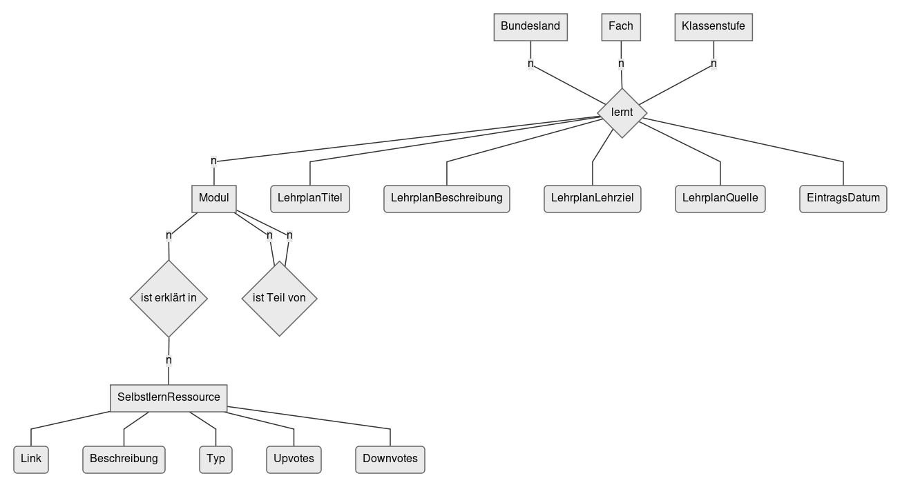

<h1 align="center">Deutschland lernt selbst.</h1>

## Die Idee
Ziel ist es, für Schüler und Lehrer deutschlandweit eine Plattform bereitzustellen, auf der sie Links zu Selbstlern-Ressourcen miteinander austauschen können, die im Netz frei verfügbar sind:
- Jede Person soll für ihr Bundesland, ihr Fach, und ihre Klassenstufe die passenden Materialien angezeigt bekommen. 
- Jede Person soll auch selbst Materialien hinzufügen können, sowie bestehende Materialien bewerten können. Wichtig ist, dass die Materialien und Bewertungen immer für alle Bundesländer verfügbar gemacht werden. Das heißt, eine Mathelehrerin aus Berlin trägt z. B. eine interaktive Website zum Binomialgleichungen ein, die in Berlin in der siebten Klasse behandelt werden. In Bayern werden diese aber schon in der sechsten Klasse behandelt. Dann wird die Website sowohl Siebtklässlern in Berlin, als auch Sechstklässlern in Bayern angezeigt, mit denselben Bewertungen. (Fiktives Beispiel!)
- Es sollen alle Fächer und alle Schularten unterstützt werden (inklusive Grundschule). Für den Prototyp werden erst einmal die Lehrpläne für Deutsch und Physik in den gymnasialen Oberstufen in Baden-Württemberg, Bayern und Berlin erstellt.

Das Projekt strebt an, eine Datenbank zu erstellen, die aus zwei Teilen besteht:
1. Eine Zuordnung `Bundesland + Fach + Klassenstufe` → `Liste von Modulen`. Diese Zuordnung soll (je nach verfügbarem Format manuell bzw. automatisiert) einmal aus den Lehrplänen extrahiert werden und dann gegebenenfalls jährlich aktualisiert werden.
2. Eine Zuordnung `Modul` → `Liste mit Selbstlern-Ressourcen`. Diese Daten sollen im Wesentlichen von der Community aus Schülern und Lehrern selbst eingetragen und bewertet werden.

Die Datenbank soll über eine Website zugänglich sein. Die Website soll anfangs einmal Bundesland, Klassenstufe, Kern- und Nebenfächer abfragen und lokal speichern. Daraufhin werden die verfügbaren Ressourcen pro Fach und nach Bewertungen sortiert angezeigt. Es soll auf der Website unkompliziert möglich sein, neue Einträge hinzuzufügen und bestehende Einträge zu bewerten.

[Überblick über verwandte Projekte.](projekt/verwandte-projekte.md)

## Technologie

Die Website wird mit [Vue.js](https://vuejs.org/v2/guide/) konzipiert und mit [Heroku](https://devcenter.heroku.com/categories/reference) [gehostet](https://dashboard.heroku.com/apps/deutschland-lernt-selbst). Die Daten werden in einer zugehörigen [PostgreSQL](https://www.postgresql.org/docs/12/index.html)-Datenbank bei Heroku gespeichert.

### Datenbank

Siehe [database/init.sql](database/init.sql).

## Mitmachen

- [Discord-Server](https://discord.gg/EUUyrK4)
- [Projekt-Kanban](https://github.com/davidpomerenke/deutschland-lernt-selbst/projects/2)

