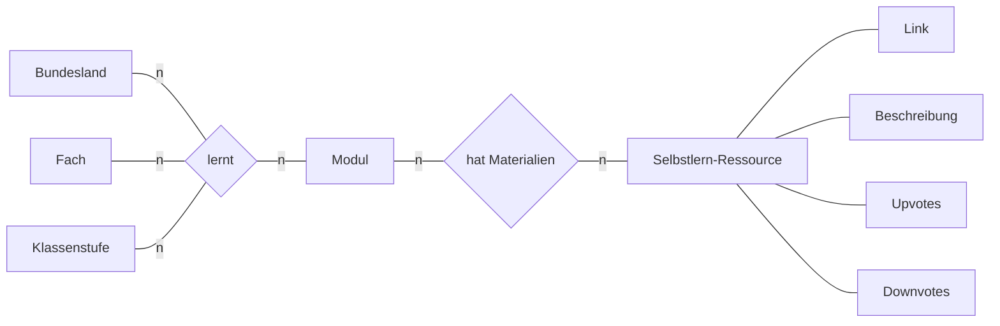
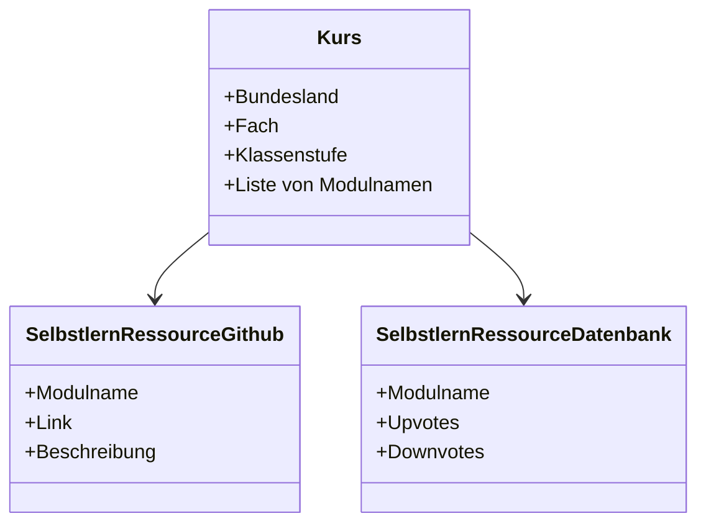
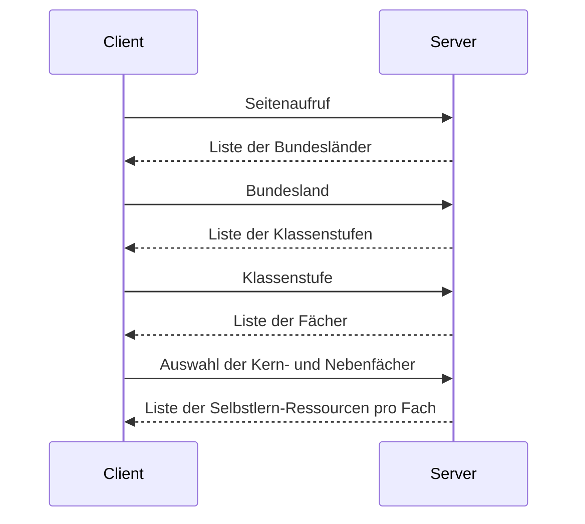
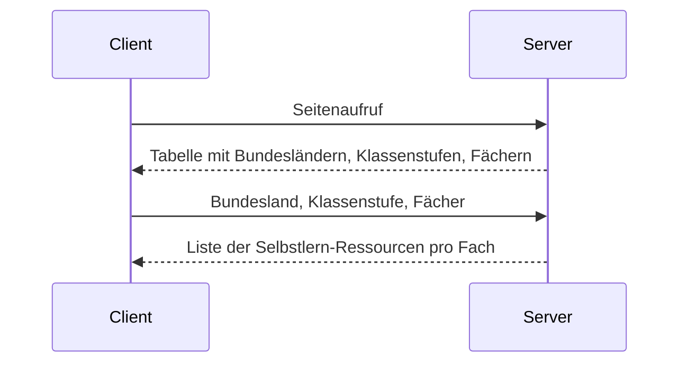
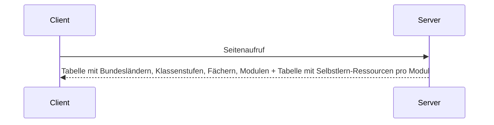

 # Diagramme

[Mermaid](https://mermaid-js.github.io/mermaid/#/classDiagram) is used for rendering. It is supported natively by some markdown editors such as [Typora](https://typora.io/), otherwise it is easiest to copypaste the code from and to the [Mermaid web editor](https://mermaid-js.github.io/mermaid-live-editor).

## Entity-Relationship Diagramm

## Klassen-Diagramm

## Beispiel-Daten

## Ablauf-Diagramm

